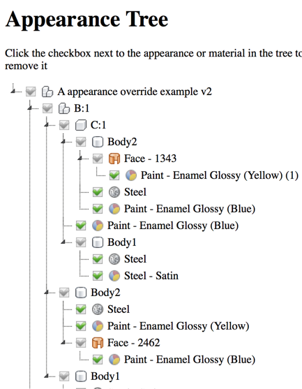

# Fusion360 Appearance Utilities
Set of Utilities to simplify working with Appearances in Fusion 360

The documentation still needs much work but here is a rough outline

_Note: there is an issue if you have an appearance applied to the root
component of your design, the utility won't be able remove it._

# Commands:

### Appearance Tree

See image above.  Displays a tree of all applied materials and appearances.
* By un-checking a material or appearance you can remove it from the model.
* Hitting the refresh button will remove all unchecked appearances from the model and refresh the tree.
* Expand All and Collapse all do just that.
* Search allows you to filter the tree.  _Note: there is an issue where you may have to click in the Fusion 360 graphics window and back into the search box to get the cursor to go into the search box._

### Remove All Appearances.

Removes all appearance overrides in the model

### Remove Appearances

Displays all objects associated with each appearance in the model allows you to selectively remove applications.

# Setup
Download or clone this repo.

Move the folder into your add-ins directory.  [Click Here](https://tapnair.github.io/installation.html) for more information

Files in the Fusion360Utilities folder should not be modified.

Rename the following items to your desired addin name:
* The top level folder
* Fusion360AddinSkeleton.py
* Fusion360AddinSkeleton.manifest

Edit the manifest file and update the fields accordingly

## License
Samples are licensed under the terms of the [MIT License](http://opensource.org/licenses/MIT). Please see the [LICENSE](LICENSE) file for full details.

## Written by

Written by [Patrick Rainsberry](https://twitter.com/prrainsberry)   (Autodesk Fusion 360 Business Development)

See more useful [Fusion 360 Utilities](https://tapnair.github.io/index.html)

